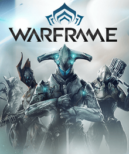

- # **👋 Hi, I’m Mohamed Ibrahim**
- Who is Mohamed you might ask, well im a guy who likes to work with computers and have worked with computers for a long time. I have other interests of course but for those you will have to look slightly lower than this initial post. If you have any questions conserning my self you can reach me via email or text. Anyway its time to get into it.
  # **Interests**
- 👀 I’m a guy who really likes computers.
- I also like to game, what games specifically? Well that is a tough one I really like to play a variety of games. The games I'm currently interested in are:
- Destiny 2
> 
- Warframe
> 
- Honaki Star Rail
> 
- and all the Soulsborne games(my favorite of them all is Bloodborne).
> 
- Some of the other things that I like is voice acting (I am just starting out). Another thing that I really like are cats(if you couldn't already tell)
>      
  # **Extra Facts**
- I’m currently learning on how to become a Software Engineer.
- Pronouns: He/him
- Fun fact: I lived in Saudi Arabia for 5 years.

<!---
Moibrahi7/Moibrahi7 is a ✨ special ✨ repository because its `README.md` (this file) appears on your GitHub profile.
You can click the Preview link to take a look at your changes.
--->
